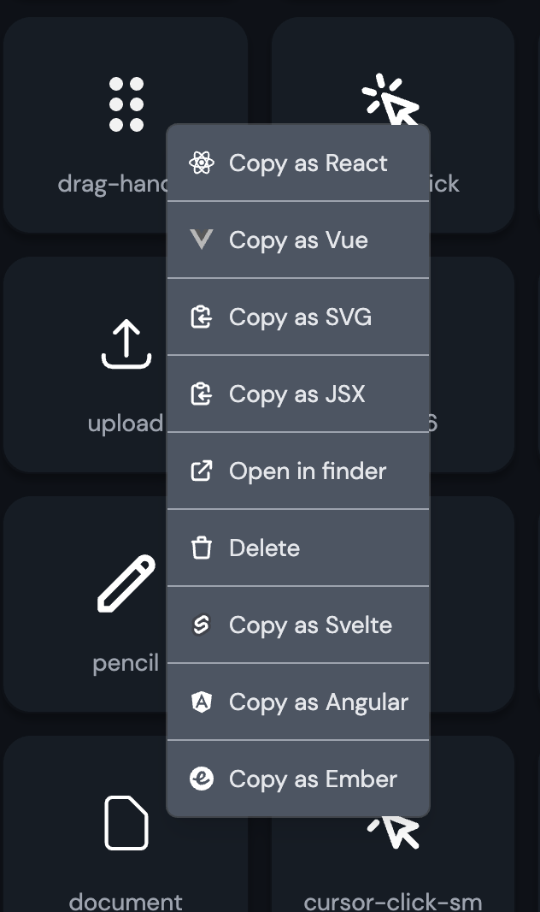
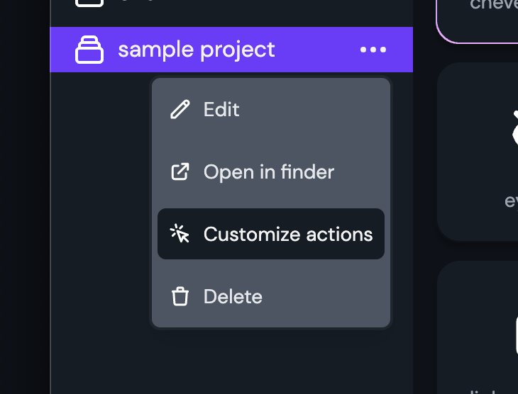
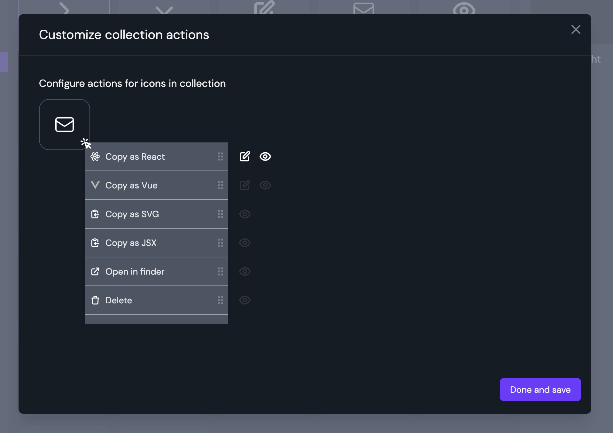
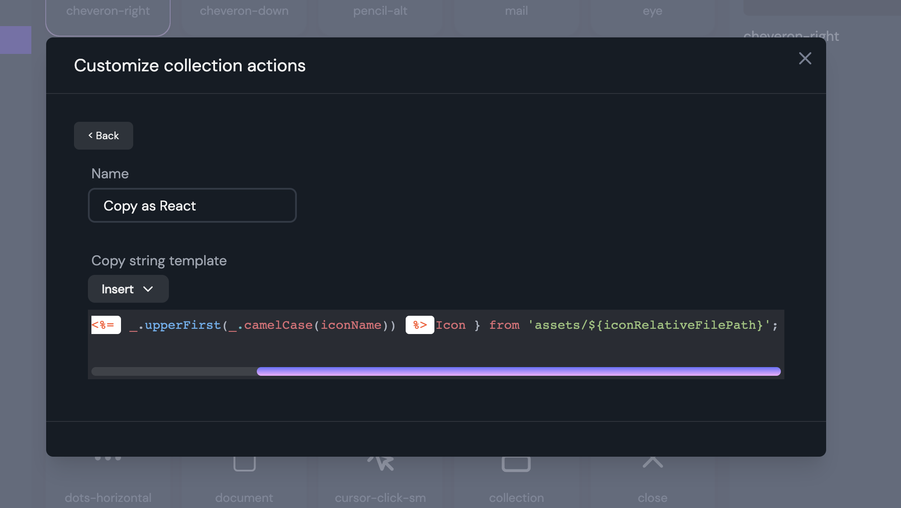

Icon Shelf gives you a variety of options to copy icon to code.



All of the copy as code options are customizable.

Let's customize the "copy as React" option.
And we wan't our icon code import statements to be something like this:

```js
import { ReactComponent as DragHandleIcon } from "assets/drag-handle.svg";
```

<div class="pb-8"></div>

Start by going to the collections options menu and click on **"Customize action"** menu item.



<div class="pb-8"></div>

You will see a bunch of actions present. Let's focus on "Copy as React".
Click on the edit icon beside "Copy as React".



In the template editor, paste the following code:

```js
import { ReactComponent as <%=  _.upperFirst(_.camelCase(iconName)) %>Icon } from 'assets/${iconRelativeFilePath}';
```

<div class="mb-4"></div>



<div class="pb-8"></div>

Go back and click "Done and save".

You should now be able to execute "Copy as React" action and have the desired import statement coped to clipboard.

### Better understanding the copy template editor

<!-- image of editor -->

This editor is a string builder for customizing the copy to code actions.
You have **variables** such as Icon name, path etc and functions to build the desired import code statement.

Let's take the below example template and better understand it.

```js
import { ReactComponent as <%=  _.upperFirst(_.camelCase(iconName)) %>Icon } from 'assets/${iconRelativeFilePath}';
```

<br></br>

- `import { ReactComponent as` is just plain text to be inserted at the beginning.
- `<%= ... %>` is the execution block. Here you can call javascript and loadash [Loadash](https://lodash.com/docs/4.17.15#camelCase) functions to transform variables.
  - Breaking down `<%= _.upperFirst(_.camelCase(iconName)) %>Icon` we see:
  - `_.camelCase(iconName)` makes the icon name in camel case. eg: dragHandle
  - `_.upperFirst(...)` makes the first letter of if name to upper case. eg DragHandle
  - `<%= ... %>Icon` concatenates an "Icon" to end of the text. eg: DragHandleIcon
- The last part is `from 'assets/${iconRelativeFilePath}';`
  - here we add "assets" to the beginning of the iconRelativeFilePath variable

#### Variables

Some of the variables that can be used in the template editor are:

- iconName - the file name of the icon
- iconRelativeFilePath - the relative file path of the icon based on the collection folder
- iconAbsoluteFilePath - the absolute file path of the icon
- iconFileType - the file type of the icon

#### Function

You can you any of the javascript in-build functions like replace, slice, trim...

<div class="-mb-6"></div>
eg: iconName.replace('icon', '')

<div class="mb-4"></div>
You can also use most of the string functions of Loadash
(https://lodash.com/docs/4.17.15#camelCase) in template execution block.
