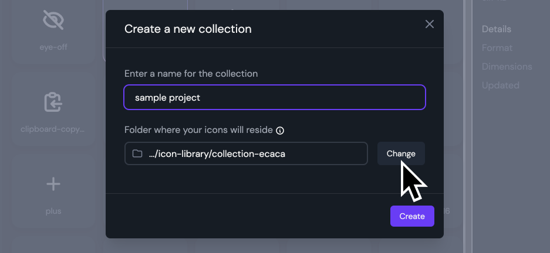
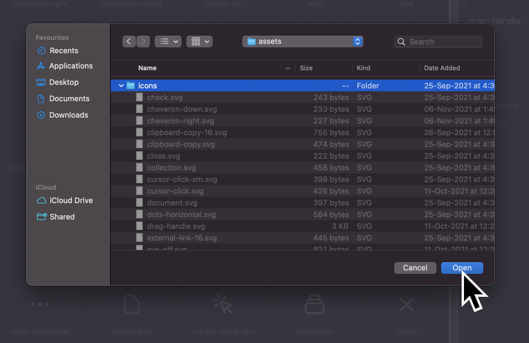
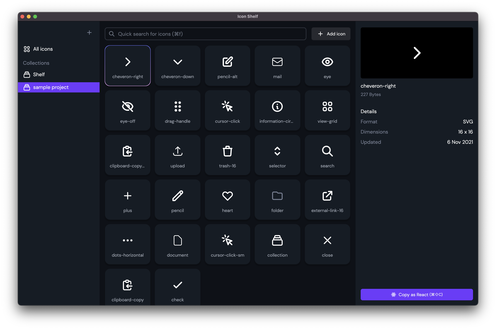

You can connect an existing folder with SVG icons in it to Icon Shelf and instantly see all your icons in Icon Shelf.

1. The first step is to create a new collection. Click on the plus icon at the top left.
   

2. Now click the Change button below the "Folder where your icons will reside" label.
   

3. Select your assets folder from the file explorer that opened.
   

Click **create** and Tada 🎉!
Your icons should now start showing up on the screen.

