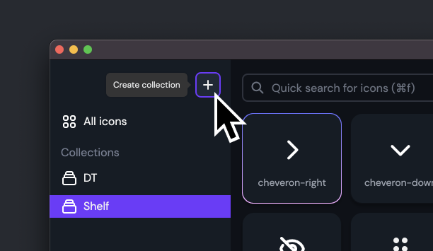

You can connect an existing folder that contains SVG icons to Icon Shelf and instantly see all your icons in Icon Shelf.

1.&nbsp;The first step is to create a new collection. Click on the plus icon at the top left.

2.&nbsp;Now click the Change button below the "Folder where your icons will reside" label.

3.&nbsp;Select your assets folder from the file explorer dialogue.

Click **create** and Tada 🎉!

Your icons should now start showing up on the screen.

