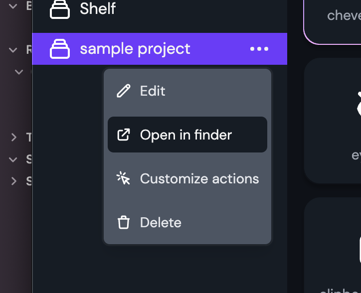

Icon Shelf by itself does not have any sharing or syncing capability.
But you can pair it with tools like Github/Dropbox/OneDrive etc and sync your icon library with the team.

Go to the collections list item menu and click on "Open in finder/file explorer"

Now add this folder to Github or Dropbox/iCloud Drive/Box/OneDrive's shared folder.

Make sure all team members have access to your icon library folder.

Now, whenever the folder is synced through Git/Dropbox/OneDrive clients, the icon will be updated in Icon Shelf as well.
